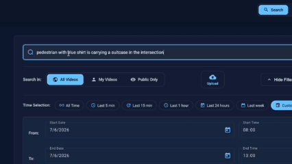
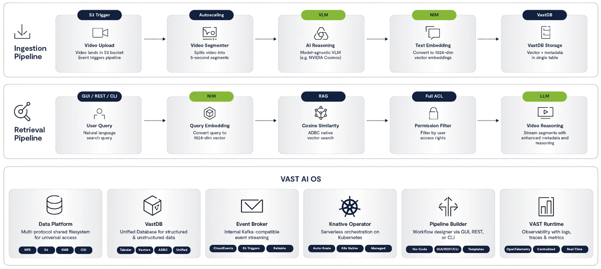

# VAST DataEngine - Video Search and Summarization (VSS) Foundation Stack


- A Real-Time Video Search and Analysis system powered by [VAST DataEngine](https://www.vastdata.com/platform/dataengine), using [Nvidia NIM's](https://www.nvidia.com/en-eu/ai-data-science/products/nim-microservices/) & [Cosmos-Reason Models](https://huggingface.co/nvidia/Cosmos-Reason2-8B).

- This Blueprint is were released to bridge the gap between [NVIDIA’s VSS reference architectures](https://build.nvidia.com/nvidia/video-search-and-summarization/blueprintcard), and showcases the e2e utilization of the full VAST AI OS production-grade capabilities,
including Agentic & Serverless Event-based Compute Framework and VastDB Vector-Store.

---



---

## Overview

The system has three main parts:
1. **K8s Application** - Web UI and REST API (Kubernetes)
2. **Ingest Pipeline** - Serverless video processing (VAST DataEngine)
3. **Enrichment Pipeline** - Scheduled prompt-suggester (search chips + key events)

 — see also the interactive diagram in the app (**Show Blueprint Diagram**) or [`blueprint.html`](source-code/retrieval/video-frontend/src/assets/blueprint.html)

---

## Deployment

| Component | Guide |
|-----------|-------|
| **VSS - Retrieval Web UI; K8s Application** (Backend, Frontend, Streaming, Batch Sync) | [vss-k8s-application](deployments/vss-k8s-application/README.md) |
| **VSS - DataEngine; Ingest Pipeline** (Segmenter, Detector, Reasoner, Embedder, Writer) | [dataengine-vss-ingest-pipeline](deployments/dataengine-vss-ingest-pipeline/README.md) |
| **VSS - DataEngine; Enrichment Pipeline** (prompt-suggester, optional) | [dataengine-vss-ingest-pipeline](deployments/dataengine-vss-ingest-pipeline/README.md) |
| **GPU models** (Cosmos-Reason2, Cosmos-Embed1, YOLO11 on Docker) | [vss-blueprint-models](scripts/vss-blueprint-models/README.md) |

### Quick Start

1. **GPU models** (Reason2, Embed1, YOLO on a GPU host): [vss-blueprint-models](scripts/vss-blueprint-models/README.md)

2. **Build and push images** (`REGISTRY` is required; `TAG` defaults to `v1`):
   ```bash
   # K8s app (backend, frontend, streaming, batch-sync)
   REGISTRY=your.registry/vss source-code/scripts/build-retrieval-images.sh

   # DataEngine functions (ingest + prompt-suggester)
   REGISTRY=your.registry/vss source-code/scripts/build-vastde-functions.sh
   ```
   Details: [K8s Step 2](deployments/vss-k8s-application/README.md#step-2-docker-images) · [DataEngine build](deployments/dataengine-vss-ingest-pipeline/README.md#build-dataengine-function-images) · [scripts](source-code/scripts/README.md)

3. **Deploy K8s Application:**
   ```bash
   cd deployments/vss-k8s-application
   vim backend-secret.yaml  # Configure credentials
   ./QUICK_DEPLOY.sh <namespace> <cluster_name>
   ```

4. **Deploy Ingest Pipeline** (choose one):
   - **Using GUI:** Configure `vss-gui-secret-file-template.yaml`, then use DataEngine UI
   - **Using CLI:** Configure `vss-cli-secret-file-template.yaml`, then run vastde commands
   
   See [Ingest Pipeline Guide](deployments/dataengine-vss-ingest-pipeline/README.md) for full instructions (optional enrichment is the last step of the same GUI or CLI path).

5. **Test:** Upload a video and search at `http://video-lab.<cluster_name>.vastdata.com`

---

## Key Features

| Feature | Description | Documentation |
|---------|-------------|---------------|
| **Video Analysis Prompts** | Configurable AI scenarios (surveillance, traffic, live_driving, etc.) | [video-reasoner](source-code/ingest/video-reasoner/README.md) |
| **Ingest metadata config** | Single definition for upload metadata UI + S3 mapping (`ingest_metadata.py`) | [shared](source-code/shared/README.md) |
| **Custom AI Prompts** | Per-video custom prompts (max length in `ingest_metadata.py`) | [video-reasoner](source-code/ingest/video-reasoner/README.md#custom-prompts) |
| **Metadata Filters** | Filter by camera_id, location, capture_type | [ingest](source-code/ingest/README.md) |
| **Advanced Search & AI Settings** | Max clip cards, synthesis clip count, caption/video weight, similarity | [video-backend](source-code/retrieval/video-backend/README.md#gui-settings) |
| **Explore mode** | Browse indexed uploads by day and location — no query; summarize any video on demand | [video-frontend](source-code/retrieval/video-frontend/README.md#application-modes) |
| **Data Dashboard** | VastDB stats, ingest health, S3 pipeline inventory, live key events | [video-frontend](source-code/retrieval/video-frontend/README.md#application-modes) |
| **Search suggestions & key events** | Grounded ≤8-word rephrases of segment `reasoning_content` → `vss-prompts-events` | [prompt-suggester](source-code/enrichment/prompt-suggester/README.md) |
| **Object detection counts** | YOLO peak concurrent per class (`object_counts`); UI chips + dashboard heatmap | [video-detector](source-code/ingest/video-detector/README.md) |
| **Agent APIs** | Tool wrappers + grounded Q&A for external agents | [video-backend](source-code/retrieval/video-backend/README.md#agent-apis) |
| **Time Filtering** | Filter by upload time (presets or custom range) | [video-backend](source-code/retrieval/video-backend/README.md#gui-settings) |
| **Video Streaming** | Capture YouTube videos to S3 | [video-streaming](source-code/video-streaming/README.md) |
| **Batch Sync** | Copy MP4 files between S3 buckets | [video-batch-sync](source-code/video-batch-sync/README.md) |
| **Authentication** | VAST username + password | [video-backend](source-code/retrieval/video-backend/README.md) |

---

## Component Documentation

| Component | Description |
|-----------|-------------|
| [shared](source-code/shared/README.md) | Cross-service modules (`ingest_metadata.py` — upload metadata UI + S3) |
| [scripts](source-code/scripts/README.md) | Build scripts for retrieval images and DataEngine functions |
| [video-backend](source-code/retrieval/video-backend/README.md) | REST API, authentication, search |
| [video-frontend](source-code/retrieval/video-frontend/README.md) | Angular web UI (Search, Explore, Dashboard) |
| [prompt-suggester](source-code/enrichment/prompt-suggester/README.md) | Grounded search chips + key events → VastDB |
| [video-streaming](source-code/video-streaming/README.md) | YouTube capture service |
| [video-batch-sync](source-code/video-batch-sync/README.md) | S3 batch copy service |
| [video-segmenter](source-code/ingest/video-segmenter/README.md) | Splits videos into segments |
| [video-detector](source-code/ingest/video-detector/README.md) | YOLO11 object detection + peak counts + bbox sidecars |
| [video-reasoner](source-code/ingest/video-reasoner/README.md) | Plain searchable `reasoning_content` (Cosmos-Reason2) |
| [video-embedder](source-code/ingest/video-embedder/README.md) | Text (`reasoning_content`) + visual embeddings |
| [vastdb-writer](source-code/ingest/vastdb-writer/README.md) | Stores vectors and segment rows in VastDB |

---

## Pipeline Flow

```
Upload Video → vss-chunks bucket
                    ↓
            video-segmenter (~5s clips, trim to capture_interval)
                    ↓
            video-detector (YOLO11 → object_classes + peak object_counts + bbox sidecars)
                    ↓
            video-reasoner (Cosmos-Reason2 → searchable plain reasoning_content ≤1024)
                    ↓
            video-embedder (vectors from reasoning_content + vectors_visual from MP4)
                    ↓
            vastdb-writer (segment rows in VastDB)
                    ↓
              Search Ready
                    ↓
         prompt-suggester (optional enrichment)
                    ↓
         vss-prompts-events (grounded search chips + key events)
```

**Search flow:** query embed (Cosmos-Embed1) → hybrid search (`reasoning_content` + visual) → clip cards with upload-time badge and match timeline → Cosmos-Reason2 synthesis → player with bbox overlay and `label N` object chips

**Explore flow:** browse by upload date and **location** (fully indexed chunks only) → clip cards with segment timeline and upload-time badge → full-chunk player with bbox toggle and **Summarize Video**

**Dashboard flow:** VastDB KPIs + ingest quality + object **instance** heatmap (sum of peak counts) + S3 vs index alignment → key events (grounded rephrases) with in-place segment preview

**Enrichment flow:** sample recent `reasoning_content` → one grounded ≤8-word phrase per sample (no inventing) → search chips + key events

**Agent flow:** `GET/POST /api/v1/tools/*` for VastDB/search/explore/synthesize → `POST /api/v1/agent/ask` or `/search-and-answer` for grounded answers

Interactive diagram: open **Show Blueprint Diagram** in the app, or `source-code/retrieval/video-frontend/src/assets/blueprint.html`

---

## Need Help?

- **K8s Deployment**: See [K8s Application Guide](deployments/vss-k8s-application/README.md#troubleshooting)
- **Ingest / Enrichment Pipeline**: See [DataEngine Pipeline Guide](deployments/dataengine-vss-ingest-pipeline/README.md)
- **Community**: [VAST Community Forums](https://community.vastdata.com/)
