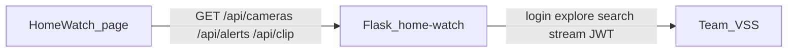

# Three-camera attention board (UI + thin backend)

**Backend is in scope. User-facing login is not.** The browser talks only to our app. Our app talks to VSS (login, explore, search, stream) using team creds from the deploy Secret. No username/password screen.

Work out of `home-watch/` in this repo. Do **not** modify the official Angular retrieval frontend under `source-code/retrieval/`.



## Backend

Flask (`main.py`) on `0.0.0.0:$PORT`. Env: `VSS_URL`, `VSS_USERNAME`, `VSS_PASSWORD`. Cache a JWT; re-login on 401. Do not log tokens or passwords.

| Route | Behavior |
|-------|----------|
| `GET /` | Static ops board |
| `GET /health` | Liveness |
| `GET /api/cameras` | Latest indexed clip per pinned `camera_id` via Explore; returns labels + `/api/clip?...` playback src |
| `GET /api/alerts` | Two VSS searches, merged: house presence (`neighborhood_cam-1`), dashcam hazard (`pie_cam-3`) |
| `GET /api/clip` | Redirect or proxy `GET /api/v1/videos/stream?source=…&token=JWT` so the `<video>` tag never calls VSS with a raw token |

There is no VSS `/alerts` route. Alerts are our ranking of search `chunk_results` (`reasoning_content`, timestamps, camera, clip). JWT stays on the server (clip URL is our route).

Optional later: `POST /agent/search-and-answer` for a one-line blurb. v1 stays on search so the page stays fast.

## UX

```text
[ Home Watch          team-44  healthy ]
[ Indoor ceiling ] [ Dashcam ] [ House exterior ]
     player            player        player
[ Needs attention ]
  - House · person walking dog on sidewalk · clip
  - Car   · pedestrian crossing while SUV braking · clip
```

- Three cards: Indoor / In the car / Outside the house.
- Alert feed from `/api/alerts`; click loads that segment on the matching camera.
- Indoor is display-only in v1 (no occupancy alerts).
- Dark compact ops-board. One page; opens straight into cameras.

Pinned cameras:

| Card | `camera_id` | `location` | Seed clip |
|------|-------------|------------|-----------|
| Indoor | `smartspace_cam-1` | `indoor` | `...Warehouse_017_Camera_chunk_0009.mp4` |
| Dashcam | `pie_cam-3` | `toronto` | `...set06_video_chunk_0014.mp4` |
| House | `neighborhood_cam-1` | `neighborhood` | `...neighborhood_20260901_chunk_0007.mp4` |

Alert queries (server-side):

- House: `camera_id=neighborhood_cam-1`, person / dog / vehicle at driveway or sidewalk
- Dashcam: `camera_id=pie_cam-3`, pedestrian in roadway, brake lights, road work, sudden stop

## Deploy

Follow the deploy-app-no-registry skill: ConfigMap of `home-watch/`, Secret from `/config/team-44.config`, Deployment `python:3.12-slim`, Ingress `/app` on `video-lab-team-44.cosmos.vastdata.com`. Namespace `team-44`. Kubeconfig: `/config/team-44-k8s.yaml`. Locate `kubectl` before apply. Keep the app under ~1 MiB. Flask + `requests` only.

Public URL: `http://video-lab-team-44.cosmos.vastdata.com/app`

## Out of scope

- Login / signup UI, user accounts, or SSO
- Chat / agent ask box
- Indoor occupancy alerts
- Push / SMS
- Re-ingest or new home-interior footage
- Editing the official VSS Angular app
